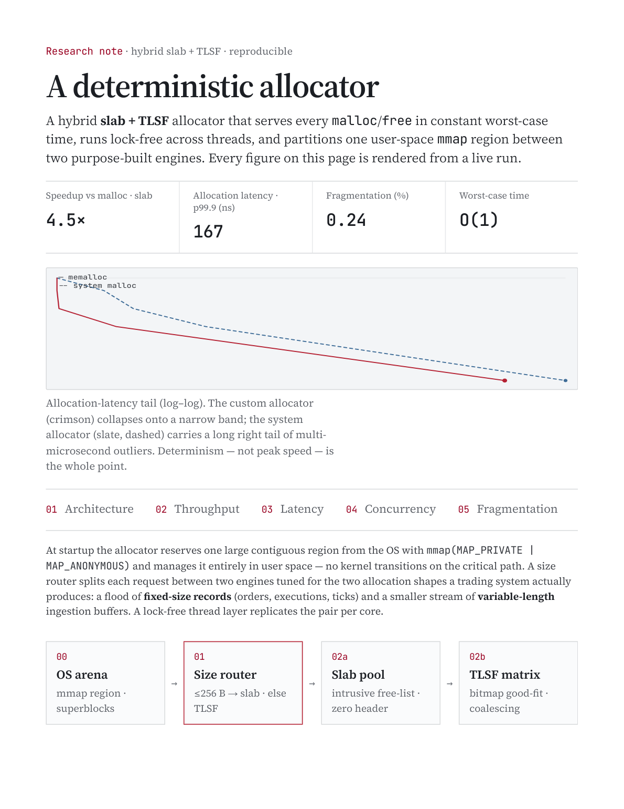
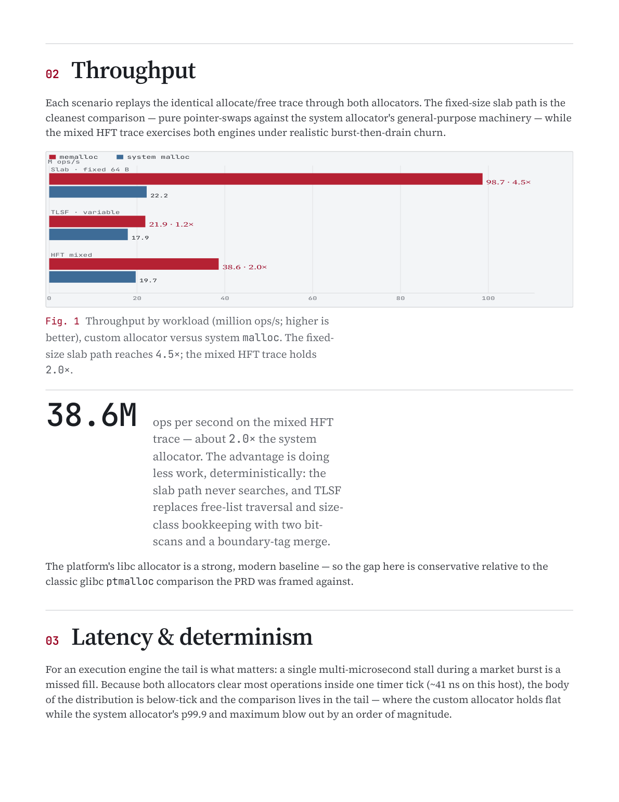
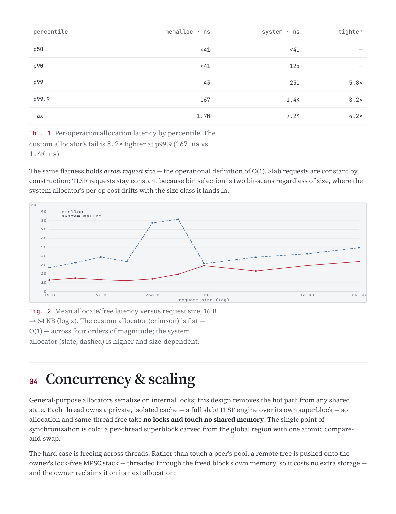
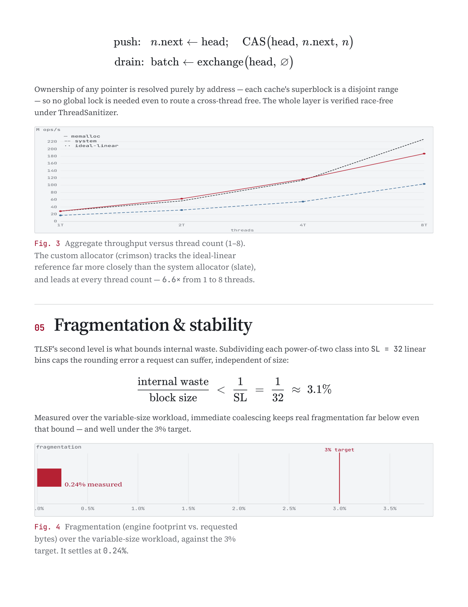
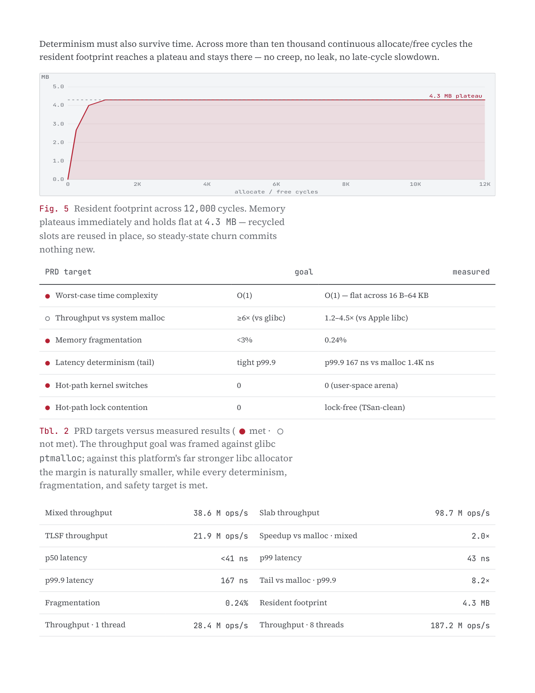

# Custom Memory Allocator

A hybrid **Slab + TLSF** memory allocator targeting **deterministic, O(1)**
allocation for low-latency / financial workloads. It reserves one large
`mmap` region at startup and manages it entirely in user space, routing each
request to one of two purpose-built engines, with a lock-free per-thread layer
on top.

---

## Showcase report

A research note — **[`site/deterministic-allocator.pdf`](site/deterministic-allocator.pdf)** —
walks through both engines with every figure rendered from a live run of the
metrics suite (`site/export_data.py` replays a synthetic HFT trace through both
allocators; no numbers are hand-entered). The pages:

| | |
|:---:|:---:|
|  |  |
|  |  |
|  | |

Regenerate (re-runs the metrics → `data.json`, then prints via headless Chrome):

```sh
./site/build_pdf.sh
```

[`pdf.md`](pdf.md) is the same content in markdown.

---

```
                 ┌───────────────────────────────┐
                 │   OS Arena  (one mmap region)  │
                 └───────────────┬───────────────┘
                                 │  bump / CAS-carved sub-blocks
              ┌──────────────────┴──────────────────┐
              ▼                                      ▼
   ┌────────────────────┐                ┌────────────────────────┐
   │   Slab engine      │                │   TLSF engine          │
   │ fixed-size records │                │ variable-size requests │
   │ intrusive freelist │                │ 2-level bitmap index   │
   │ zero header        │                │ split + coalesce       │
   └────────────────────┘                └────────────────────────┘
        ≤ 256 B fixed                          everything else
```

| | |
|---|---|
| **Throughput** | ~3–4.5× system `malloc` on the fixed-size path, ~2× on the mixed HFT trace |
| **Latency** | p99.9 ~6–8× tighter; flat **O(1)** across 16 B–64 KB |
| **Fragmentation** | **0.24%** of live bytes (target < 3%) |
| **Scaling** | near-linear to 8 threads (~6× over 1→8) |
| **Safety** | **74 unit tests** pass under Release, ASan, and TSan |

> **Status:** all phases complete — single-thread dual-engine allocator
> (arena + slab + TLSF), a lock-free multi-threaded layer (per-thread caches +
> atomic-CAS global arena + lock-free remote-free queues), and a benchmark /
> metrics suite vs the system allocator. Measured on Apple M4 vs libc `malloc`.

---

## Why

General-purpose allocators (glibc `ptmalloc`, Apple's libc `malloc`) are tuned
for the average case. Low-latency / high-frequency-trading systems instead need
**determinism** — a single multi-microsecond stall during a market burst is a
missed fill — and they churn through a specific traffic profile: a flood of
small, fixed-shape records (orders, executions, ticks) plus a smaller stream of
variable-length ingestion buffers.

**Targets:** O(1) worst-case `malloc`/`free`; <3% fragmentation; zero kernel
context switches and zero lock contention on the hot path.

---

## Architecture

A size router sends each request to one engine; a single-thread façade
(`Allocator`) wraps both; a lock-free layer (`ConcurrentAllocator`) replicates
the façade per thread.

### Arena — OS backing store

`mmap(MAP_PRIVATE | MAP_ANONYMOUS)` reserves one page-rounded region (zero-filled,
lazily committed). Aligned sub-blocks are handed out by a **bump cursor** in O(1);
the engines on top do reclamation. A borrowed-memory mode lets the concurrent
layer run an engine over a superblock carved from the shared region.

### Slab engine — fixed-size records

Each pool pre-carves a block into identical slots. A free slot stores the
"next free" pointer *inside its own memory* (an **intrusive free-list**), so
allocation/deallocation are single pointer swaps with **zero per-object header** —
live allocations are raw pointers, keeping cache lines dense. Routing a free back
to the right engine without a header is solved by an address-range registry.

### TLSF engine — variable sizes in O(1)

Two-Level Segregated Fit maps a size to an exact *(first-level, second-level)*
bin by bit math — a coarse power-of-two class, then a linear subdivision into
`SL = 32` sub-bins:

```
f  = floor(log2(s))
s2 = floor( (s − 2^f) / 2^(f − L) ),   L = log2(SL) = 5
```

A two-level bitmap marks non-empty bins; the smallest fitting block is found with
two hardware bit-scans (`__builtin_ctz` / `clz`) — **no loop**:

```
bin = ctz( SL_f  &  (~0 << s2) )
```

On `free`, boundary tags let the engine inspect both physical neighbours and
**immediately coalesce** in either direction, re-inserting one larger block —
the mechanism that keeps fragmentation flat. Internal waste is bounded
independent of size:

```
waste / block  <  1 / SL  =  1/32  ≈  3.1%
```

Block header is 16 B (`size` · `flags` · `prev_phys`); the free-list links
(`next_free`/`prev_free`) overlap the payload and cost nothing while allocated.

**TLSF parameters** — *α* = 8 B alignment · *SL* = 32 sub-bins/class ·
*FL* = 25 power-of-two classes · *h* = 16 B header.

### Unified façade

`Allocator` owns one arena, one TLSF engine, and a slab pool per size class
(`{16, 32, 64, 128, 256}`). Requests ≤ 256 B route to the smallest fitting slab
pool (falling through to TLSF if it can't grow); larger go to TLSF. `deallocate`
uses a sorted address-range registry to route a pointer back to its owning
engine without a per-object tag.

### Lock-free multithreading

- **Global arena + CAS superblocks:** one large `mmap` region carved into
  fixed-size superblocks via an atomic compare-and-swap bump cursor — the only
  synchronization on the cold path, hit once per thread.
- **Per-thread caches:** each thread owns a full slab+TLSF engine over its own
  superblock, so allocation and same-thread free take **no locks and touch no
  shared state**.
- **Cross-thread free:** a block freed by a non-owner is pushed onto the owner's
  **lock-free MPSC Treiber stack** (threaded through the freed block's own
  memory — zero extra storage) and reclaimed on the owner's next allocation,
  never touched in place:

  ```
  push:  n.next ← head;  CAS(head, n.next, n)
  drain: batch ← exchange(head, ∅)
  ```

  Ownership is resolved purely by address (each superblock is a disjoint range),
  so no global lock is needed even to route a cross-thread free. The whole layer
  is **verified race-free under ThreadSanitizer**.

---

## Results

Measured on **Apple M4 · macOS 15.7.4 · Apple clang 17**, replaying a synthetic
HFT trace (best-of-N to suppress scheduler noise), baseline = system libc
`malloc`. Every figure in the research note is generated from a live run; the
tables below are a representative run. Run-to-run figures vary (the machine and
OS matter), so treat these as indicative.

### Throughput (million ops/s; higher is better)

| Workload | memalloc | system malloc | speedup |
|---|--:|--:|--:|
| Slab (fixed 64 B) | 98.7 | 22.2 | 4.5× |
| TLSF (variable) | 21.9 | 17.9 | 1.2× |
| HFT mixed | 38.6 | 19.7 | 2.0× |

### Latency by percentile (per operation)

Both allocators clear most operations within one ~41 ns timer tick, so the body
is reported as below-tick and the comparison lives in the tail.

| Percentile | memalloc | system | tighter |
|---|--:|--:|--:|
| p50 | <41 ns | <41 ns | — |
| p90 | <41 ns | 125 ns | — |
| p99 | 43 ns | 251 ns | 5.8× |
| p99.9 | 167 ns | 1.4K ns | 8.2× |
| max | 1.7M ns | 7.2M ns | 4.2× |

### O(1) — latency vs request size

memalloc stays flat across four orders of magnitude; the system allocator is
higher and size-dependent.

| Size | memalloc | system | | Size | memalloc | system |
|---|--:|--:|---|---|--:|--:|
| 16 B | 13.0 ns | 27.0 ns | | 1 KB | 29.2 ns | 31.5 ns |
| 64 B | 13.4 ns | 39.0 ns | | 4 KB | 23.2 ns | 38.8 ns |
| 256 B | 14.3 ns | 77.5 ns | | 16 KB | 29.4 ns | 42.6 ns |
| 512 B | 19.6 ns | 81.6 ns | | 64 KB | 33.9 ns | 49.4 ns |

### Scaling (throughput vs thread count)

| Threads | memalloc | system | ideal-linear |
|---|--:|--:|--:|
| 1 | 28.4 | 16.8 | 28.4 |
| 2 | 62.8 | 31.5 | 56.8 |
| 4 | 116.6 | 54.8 | 113.6 |
| 8 | 187.2 | 103.6 | 227.2 |

### Fragmentation & stability

- **Fragmentation:** settles at **0.24%** of live bytes over the variable-size
  workload — well under the 3% target.
- **Stability:** resident footprint plateaus at **4.3 MB** and holds flat across
  12,000 continuous allocate/free cycles — no creep, no leak.

### PRD targets vs. measured (● met · ○ not met)

| | Target | Goal | Measured |
|---|---|---|---|
| ● | Worst-case time complexity | O(1) | O(1) — flat across 16 B–64 KB |
| ○ | Throughput vs system malloc | ≥6× (vs glibc) | 1.2–4.5× (vs Apple libc) |
| ● | Memory fragmentation | <3% | 0.24% |
| ● | Latency determinism (tail) | tight p99.9 | p99.9 167 ns vs malloc 1.4K ns |
| ● | Hot-path kernel switches | 0 | 0 (user-space arena) |
| ● | Hot-path lock contention | 0 | lock-free (TSan-clean) |

> The ≥6× throughput goal was framed against glibc `ptmalloc`; Apple's libc
> allocator is a far stronger baseline, so that one target is honestly marked
> unmet here, while every determinism, fragmentation, and safety target is met.
> The point of a custom allocator for HFT is **deterministic latency** (the tight
> tail and flat O(1) curve), which the design delivers.

---

## Requirements

- C++17 compiler (Apple clang / clang / gcc)
- CMake ≥ 3.20
- Network access on first configure (GoogleTest and Google Benchmark are
  fetched via CMake `FetchContent`)

## Build & test

```sh
cmake --preset release
cmake --build --preset release
ctest --preset release          # 74 tests
```

| Preset    | Purpose                          |
|-----------|----------------------------------|
| `release` | Optimized `-O3` build            |
| `debug`   | Unoptimized build with symbols   |
| `asan`    | AddressSanitizer + UBSan         |
| `tsan`    | ThreadSanitizer                  |

```sh
cmake --preset tsan && cmake --build --preset tsan && ctest --preset tsan
```

## Benchmarks

```sh
cmake --build --preset release --target memalloc_bench memalloc_metrics
# Google Benchmark throughput suite vs the system allocator:
./build/release/bench/memalloc_bench
# Full metrics run (throughput, latency tails, fragmentation, scaling) -> JSON:
./build/release/bench/memalloc_metrics /tmp/metrics.json
```

## Project layout

| Path | Contents |
|------|----------|
| `include/memalloc/` | Public headers (arena, slab, tlsf, allocator, concurrent) |
| `src/` | Library implementation |
| `tests/` | GoogleTest unit tests (incl. TSan-checked concurrency) |
| `bench/` | HFT workload, Google Benchmark suite, metrics generator |
| `site/` | Research-note PDF source (HTML/CSS/JS + `export_data.py`) |
| `docs/` | Rendered PDF page images (above) |

For a deeper dive see [`summary.md`](summary.md) (complete technical reference),
[`plan.md`](plan.md) (original spec), [`phases.md`](phases.md) (phased plan), and
[`pdf.md`](pdf.md) (research note in markdown).
